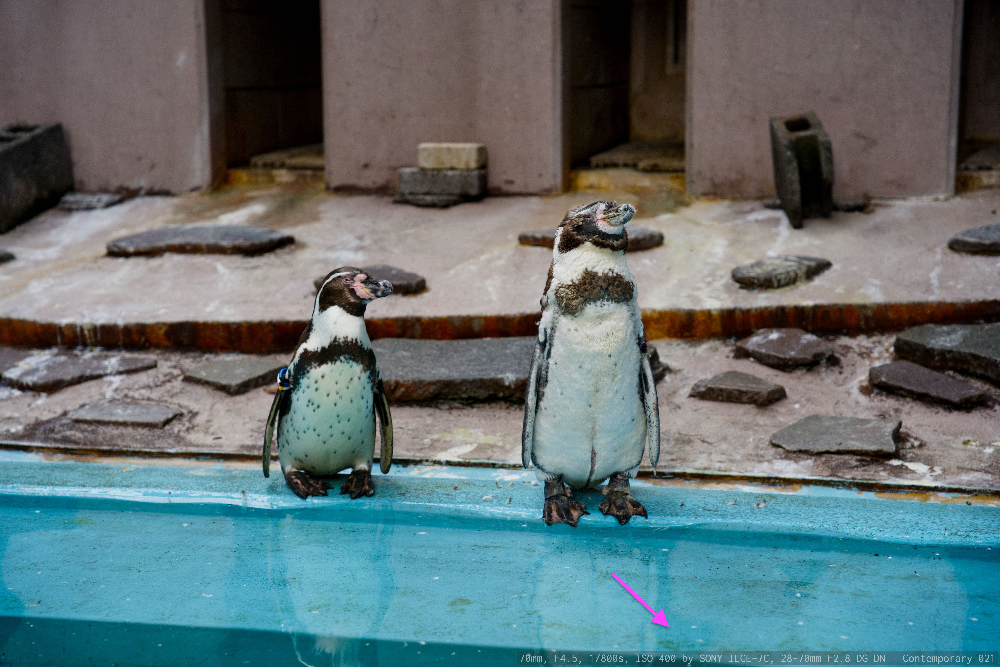

# EXIF label

A script to composite a label has exif data to pictures

## Usage

1. Install packages by `$ yarn install`

2. Put .jpg files into `images/original/`

3. Run `$ yarn run build && yarn run start`

Then, labeled pictures should be put into `images/output/`.

## Example

